# System Patterns: Express CMS

## Project Structure

Express CMS is organized as two separate but related codebases:

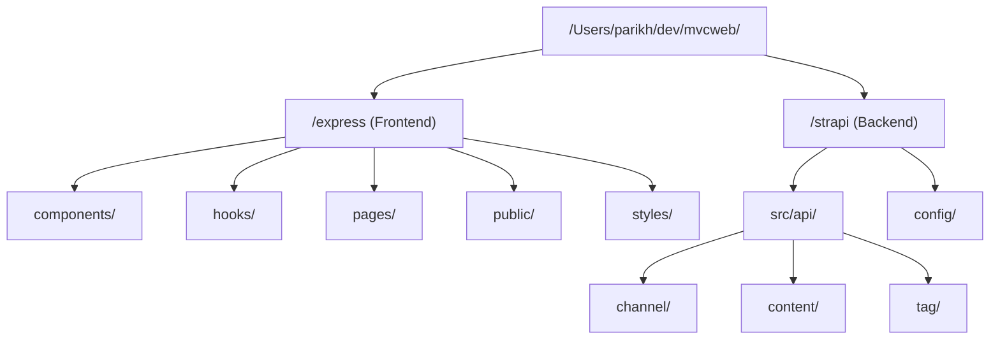

This separation allows for independent development and deployment of the frontend and backend components while maintaining a clear integration between them.

## Architecture Overview

Express CMS follows a modern web application architecture with clear separation of concerns and a multi-layered approach:

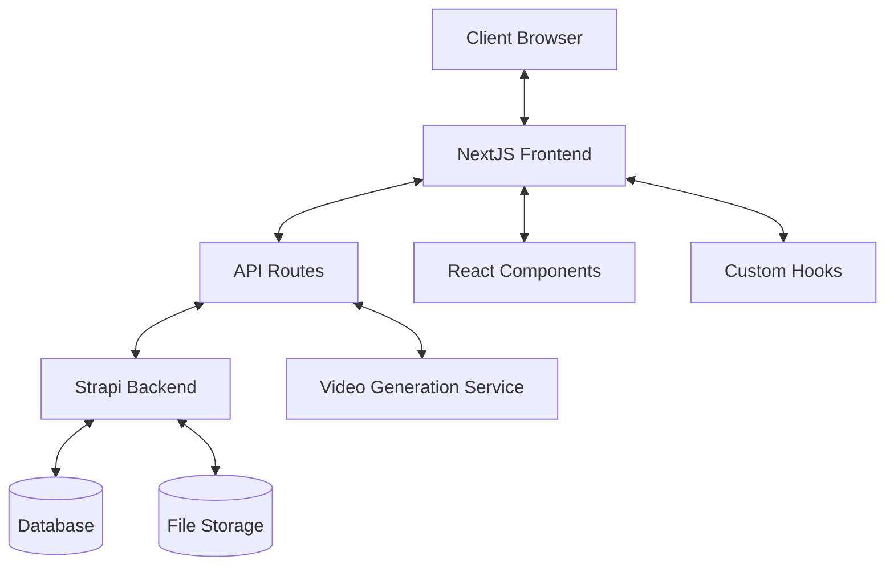

## Data Model

The system is built around these core entities:

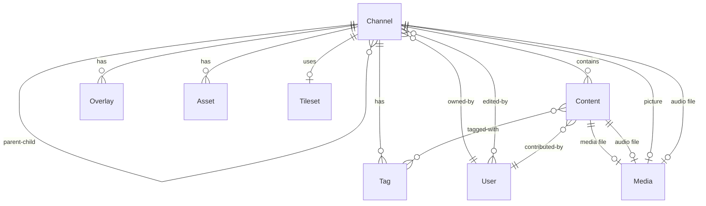

### Channel Entity
- **Core Properties**: uniqueID, name, description, public/private status
- **Location**: lat, long, zoom level
- **Media**: picture, audiofile
- **Presentation**: interval, showtitle, background/foreground colors
- **Relationships**: parent/children, owner, editors, contents, tags, overlays, assets

## Key Design Patterns

### Component-Based Architecture
The system is built using React's component-based architecture, with reusable UI components that encapsulate specific functionality:

- **Media Components**: Components for displaying and interacting with different media types (audio, video, images, YouTube, 360° content)
  - Examples: `AudioPlayer`, `VideoPlayer`, `FullImage`, `Photosphere`, `Youtube`
- **Layout Components**: Components for different presentation formats (maps, grids, slideshows)
  - Examples: `Mapper`, `Slideshow`, `TagWall`, `ImageGrid`
- **Control Components**: UI elements for user interaction and control
  - Examples: `Timeline`, `ChannelControls`, `ItemControls`, `PlayIcon`
- **Form Components**: Components for data input and content creation
  - Examples: `ChannelEditor`, `ContentEditor`, `Uploader`

### Custom Hooks Pattern
Custom React hooks encapsulate and reuse stateful logic across components:

- **API Interaction Hooks**: For data fetching and submission
  - Examples: `getChannel`, `updateSubmission`, `addChannel`, `getMyChannels`
- **Media Handling Hooks**: For processing and managing media
  - Examples: `getMediaURL`, `useMediaControl`, `uploadSubmission`
- **State Management Hooks**: For managing application state
  - Examples: `useContainerSize`, `useInactive`
- **Utility Hooks**: For common functionality like URL generation
  - Examples: `getBaseURL`, `getTagURL`, `setError`

### Page-Based Routing
NextJS page-based routing structure organizes the application into distinct functional areas:

- **/pages**: Main application pages
  - `index.js`: Dashboard showing user's channels or public channels
  - `map.js`: Map-based visualization of channel content
  - `reel.js`: Slideshow presentation of channel content
  - `tagger.js`: Interface for tagging and organizing content
  - `probe.js`: Channel creation and management
  - `upload.js`: Content upload interface
- **/pages/api**: API endpoints for server-side functionality
  - Authentication endpoints
  - Content management endpoints
  - Media processing endpoints
- **/pages/auth**: Authentication-related pages
  - OAuth callback handlers

### API Routes Pattern
Server-side functionality is implemented through NextJS API routes that act as middleware between the frontend and Strapi backend:

- **Authentication**: User registration, login, and session management
  - JWT-based authentication with HTTP-only cookies
  - Google OAuth integration
- **Content Management**: Creating, updating, and deleting content
  - Channel creation and management
  - Content submission and updating
  - Tag management
- **Media Processing**: Handling media uploads and transformations
  - File uploads to Strapi
  - Video generation through external service
- **External Services**: Integration with third-party services
  - ChatGPT for content generation
  - DALL-E for image generation
  - External video processing service

## Data Flow Patterns

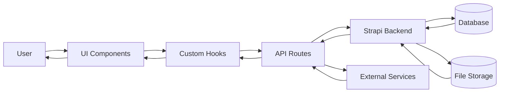

### Access Patterns

The system implements three distinct access patterns for content:

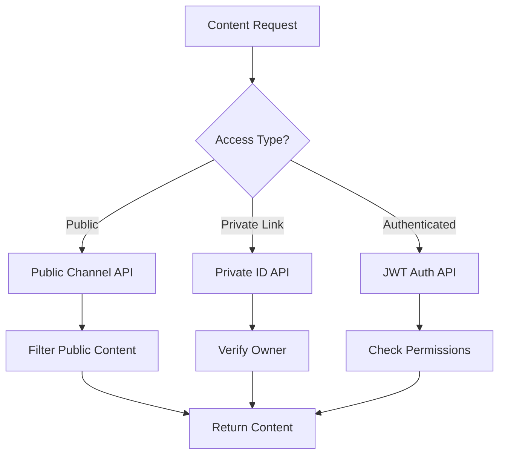

### Private ID Mechanism

The system uses a secure XOR encryption to create private access links:

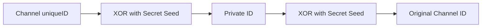

This allows for secure sharing of edit access without requiring user accounts.

## Component Communication

- **Props**: For parent-to-child component communication
  - Component configuration and data passing
  - Event handlers and callbacks
- **Custom Hooks**: For sharing state and logic between components
  - Data fetching and submission
  - Media control state
  - UI state management
- **URL Parameters**: For page-to-page communication
  - Channel IDs and private IDs
  - Current slide or view state
  - Edit mode flags
- **Refs**: For direct DOM manipulation and component interaction
  - Media element references
  - Timeline control

## Authentication Flow

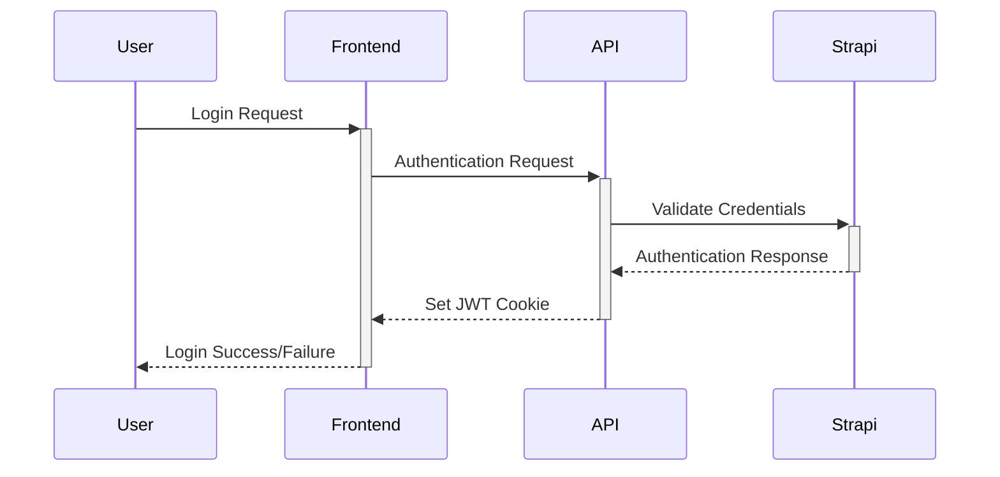

## Channel Access Flow

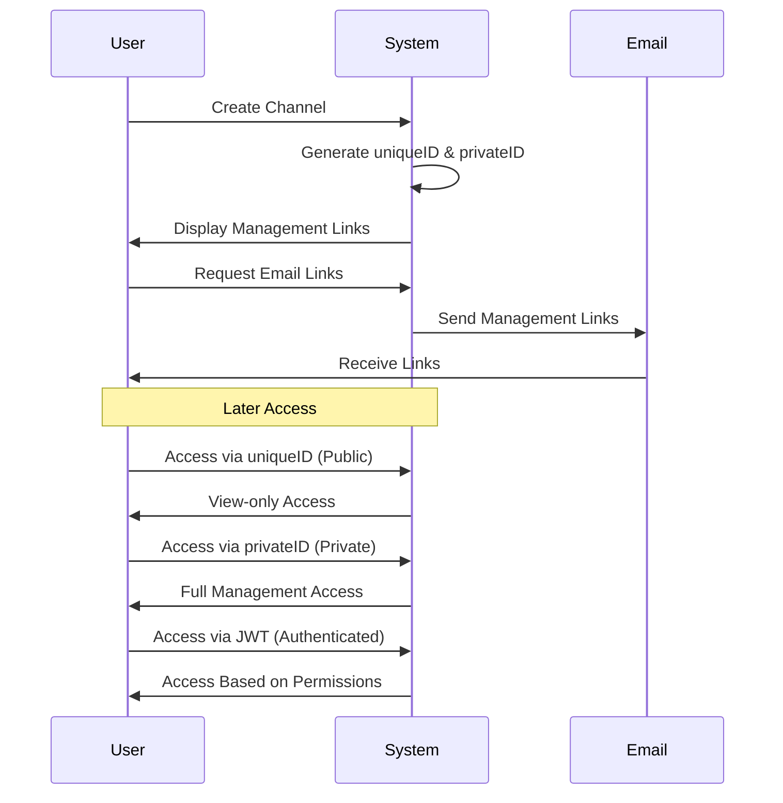

## Permission Inheritance

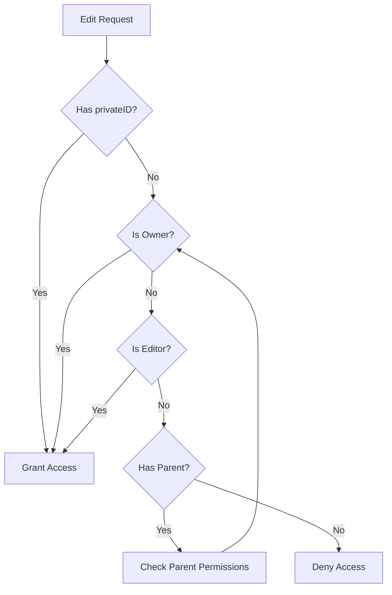

This hierarchical permission model allows for flexible content management.

## Content Filtering

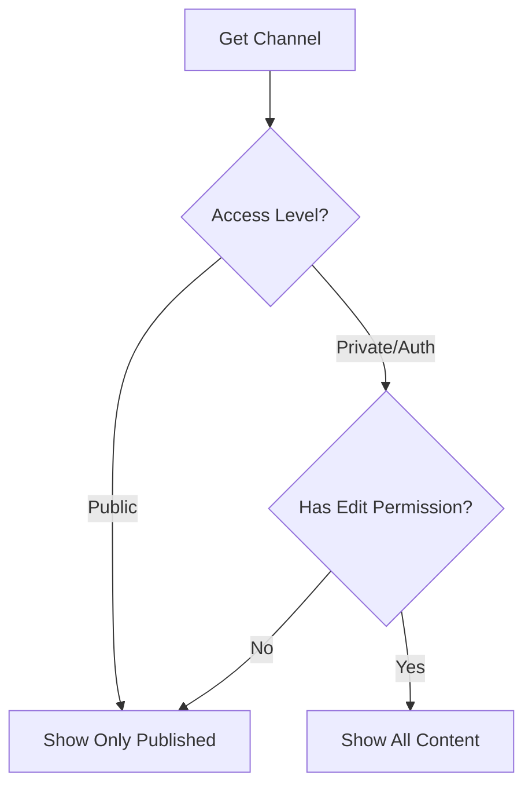

## Video Generation Flow

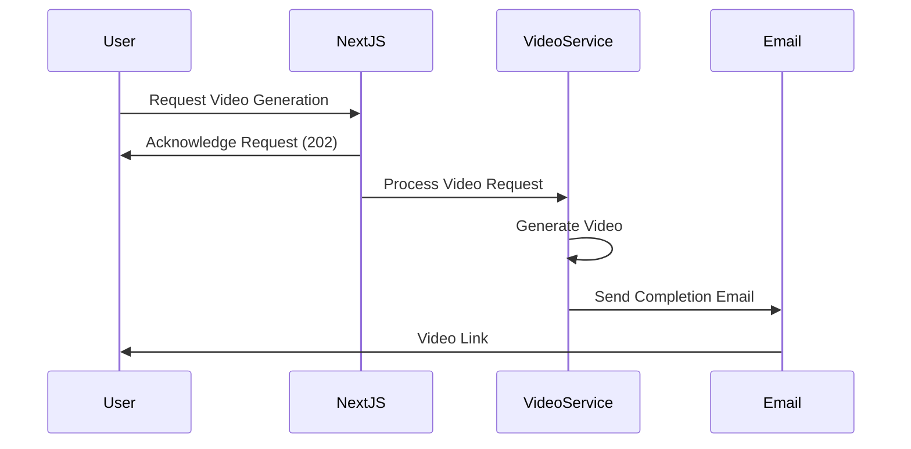

This architecture promotes maintainability, reusability, and separation of concerns throughout the application while providing flexible access patterns and integration with external services.
