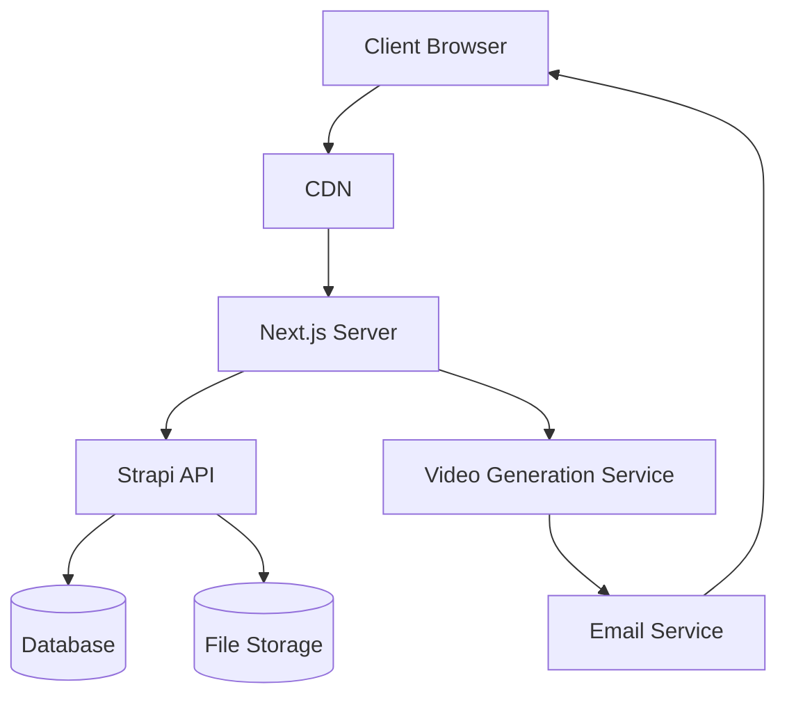
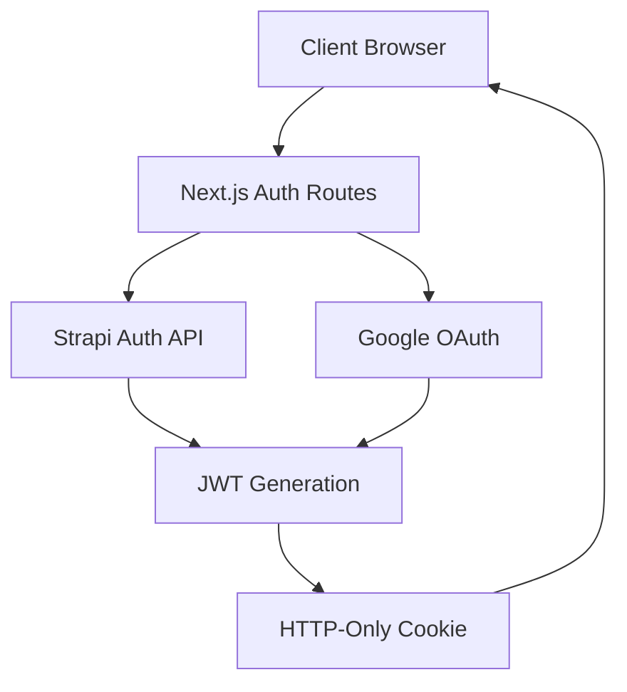

# Technical Context: Express CMS

## Project Structure

Express CMS is organized as two separate but related codebases:

1. **Frontend** (`/Users/parikh/dev/mvcweb/express`):
   - Next.js application with React components
   - Custom hooks for API interaction and state management
   - API routes for server-side functionality
   - Static assets and styles

2. **Backend** (`/Users/parikh/dev/mvcweb/strapi`):
   - Strapi headless CMS
   - Custom content types and controllers
   - Media library for file storage
   - Authentication and permission system

This separation follows the common pattern of decoupling the frontend and backend, allowing for independent development and deployment while maintaining clear integration points.

## Technology Stack

### Frontend
- **Framework**: Next.js (React-based framework for server-rendered applications)
- **UI Components**: Reactstrap (Bootstrap components for React)
- **Styling**: CSS modules and global styles
- **State Management**: React Hooks and Context API
- **Routing**: Next.js built-in routing
- **Map Integration**: Leaflet with react-leaflet for interactive maps
- **Media Players**: Custom players for various media types, including 360° content
- **Drag and Drop**: react-dnd for drag-and-drop functionality

### Backend
- **CMS**: Strapi (Headless CMS) for content management and storage
  - Custom content types for channels, content, tags, tilesets
  - Custom controllers with business logic
  - Media library for file storage and management
  - Permission system with ownership and editor roles
- **API**: Next.js API routes as middleware between frontend and Strapi
  - Request forwarding to Strapi endpoints
  - Response formatting and error handling
  - File upload processing
- **Authentication**: JWT-based authentication with HTTP-only cookies
  - Secure token storage and validation
  - Session management through Strapi
  - Three-tier access model (public, private, authenticated)
- **OAuth**: Google OAuth integration for social login
  - Callback handling in dedicated routes
  - User profile creation and linking

### Media Handling
- **Storage**: Strapi file system storage with configurable providers
  - Automatic file organization and metadata tracking
  - Support for various media formats
  - Size tracking and management
- **Processing**: External service for video generation
  - Asynchronous processing with email notifications
  - Composition of channel content into videos
  - Format conversion and optimization
- **Playback**: Specialized players for different media types:
  - Video.js for video content with timeline control
  - Custom audio player with visualization
  - Photosphere viewer for 360° images and videos
  - YouTube and Vimeo embeds with API integration
  - Support for Google Photos albums

### External Services
- **AI Integration**: 
  - OpenAI's ChatGPT for text generation
  - DALL-E for image generation
  - Integration through dedicated API routes
- **Email**: Nodemailer for sending notifications and sharing links
  - Channel management links
  - Video completion notifications
  - Content sharing
- **Video Processing**: External service at video.mahabot.in for video generation
  - Asynchronous processing with webhooks
  - Channel content compilation
  - Format options and customization
- **Geocoding**: OpenStreetMap geocoding for location-based content
  - Converting location names to coordinates
  - Extracting coordinates from image EXIF data
  - Map marker placement

## Development Environment

### Required Tools
- Node.js and npm/yarn
- Git for version control
- Code editor (e.g., VS Code)
- Local Strapi instance
- Environment variables configuration
  - API endpoints and secrets
  - Private seed for channel ID encryption
  - External service credentials

### Setup Process
1. Clone repository
2. Install dependencies (`npm install` or `yarn`)
3. Configure environment variables:
   - `NEXT_PUBLIC_STRAPI_HOST`: URL of the Strapi backend
   - `VIDEO_SERVER_URL`: URL of the video generation service
   - Other authentication and service keys
4. Start development server (`npm run dev` or `yarn dev`)
5. Start Strapi backend separately

## Key Dependencies

### Frontend Dependencies
- **next.js**: React framework for server-rendered applications
- **react**: UI library
- **reactstrap**: Bootstrap components for React
- **leaflet** and **react-leaflet**: For map functionality and markers
- **react-leaflet-cluster**: For clustering map markers
- **pure-react-carousel**: For slideshow functionality
- **react-dnd**: For drag-and-drop functionality
- **react-icons**: Icon library
- **axios**: HTTP client for API requests
- **nookies**: Cookie handling for authentication
- **mime-types**: MIME type detection for media files

### Media Dependencies
- **video.js**: Advanced video player
- **react-div-100vh**: Viewport height handling
- **react-confirm-alert**: Confirmation dialogs

### Development Dependencies
- **eslint**: Code linting
- **prettier**: Code formatting

## Deployment Architecture

## Authentication Architecture

## Environment Variables

The application requires several environment variables:
- **NEXT_PUBLIC_STRAPI_HOST**: URL of the Strapi backend
- **VIDEO_SERVER_URL**: URL of the video generation service
- **NEXT_PUBLIC_API_URL**: Public API URL for client-side requests
- **JWT_SECRET**: Secret for JWT token generation/validation
- **PRIVATE_SEED**: Secret seed for channel ID encryption/decryption
- **GOOGLE_CLIENT_ID** and **GOOGLE_CLIENT_SECRET**: For Google OAuth
- **EMAIL_SERVER**, **EMAIL_USER**, **EMAIL_PASSWORD**: For email service
- **OPENAI_API_KEY**: For ChatGPT and DALL-E integration

## Performance Considerations

- **Media Optimization**:
  - Dynamic loading of media components
  - Appropriate media formats for different devices
  - Lazy loading of media content
  
- **Rendering Optimization**:
  - Server-side rendering for initial page load
  - Dynamic imports for code splitting
  - Memoization of components (React.memo)
  - Optimized re-renders with useCallback and useMemo
  
- **Data Fetching**:
  - Server-side data fetching for SEO and performance
  - Efficient API request patterns
  - Pagination for large data sets
  
- **Map Performance**:
  - Marker clustering for dense data points
  - On-demand loading of map tiles
  - Optimized marker rendering

## Security Considerations

- **Authentication**:
  - JWT tokens stored in HTTP-only cookies
  - Proper token expiration and renewal
  - Secure authentication routes
  
- **Authorization**:
  - Three-tier access model (public, private link, authenticated)
  - Permission checks for content operations
  - Content ownership validation
  - Hierarchical permission inheritance from parent channels
  
- **Private Access Mechanism**:
  - XOR encryption of channel IDs with secret seed
  - Secure generation of channel IDs
  - Validation of private IDs before granting access
  
- **Data Protection**:
  - Input validation and sanitization
  - Protection against injection attacks
  - Secure handling of user data
  
- **Media Security**:
  - File type validation and MIME type checking
  - Size limitations and tracking
  - Content scanning and validation
  
- **API Security**:
  - CSRF protection
  - Rate limiting
  - Proper error handling without information leakage
  - Permission checks on all operations

## Accessibility

- **Semantic HTML**: Proper use of HTML elements for their intended purpose
- **ARIA Attributes**: Enhanced accessibility for complex UI components
- **Keyboard Navigation**: Support for keyboard-only users
- **Screen Reader Compatibility**: Text alternatives for non-text content
- **Color Contrast**: Compliance with WCAG guidelines
- **Responsive Design**: Adaptability to different screen sizes and devices
- **Focus Management**: Proper focus handling for interactive elements

## Browser Compatibility

- **Modern Browsers**: Full support for Chrome, Firefox, Safari, Edge
- **Mobile Browsers**: Optimized for iOS Safari and Android Chrome
- **Responsive Design**: Fluid layouts that adapt to different screen sizes
- **Touch Support**: Enhanced interactions for touch devices
- **Progressive Enhancement**: Core functionality works without advanced features
- **Feature Detection**: Graceful fallbacks for unsupported features

## Media Format Support

- **Images**: JPEG, PNG, GIF, WebP
  - Standard images
  - 360° equirectangular images
  - EXIF metadata extraction for geolocation
  
- **Video**: MP4, WebM
  - Standard videos
  - 360° videos with various mapping types
  - Custom start/end time control
  
- **Audio**: MP3, WAV
  - Standalone audio files
  - Audio overlays for images and videos
  - Visualization during playback
  
- **External Media**:
  - YouTube videos and playlists
  - Vimeo videos
  - Google Photos albums and images
  - Generic URL embedding with preview image extraction
